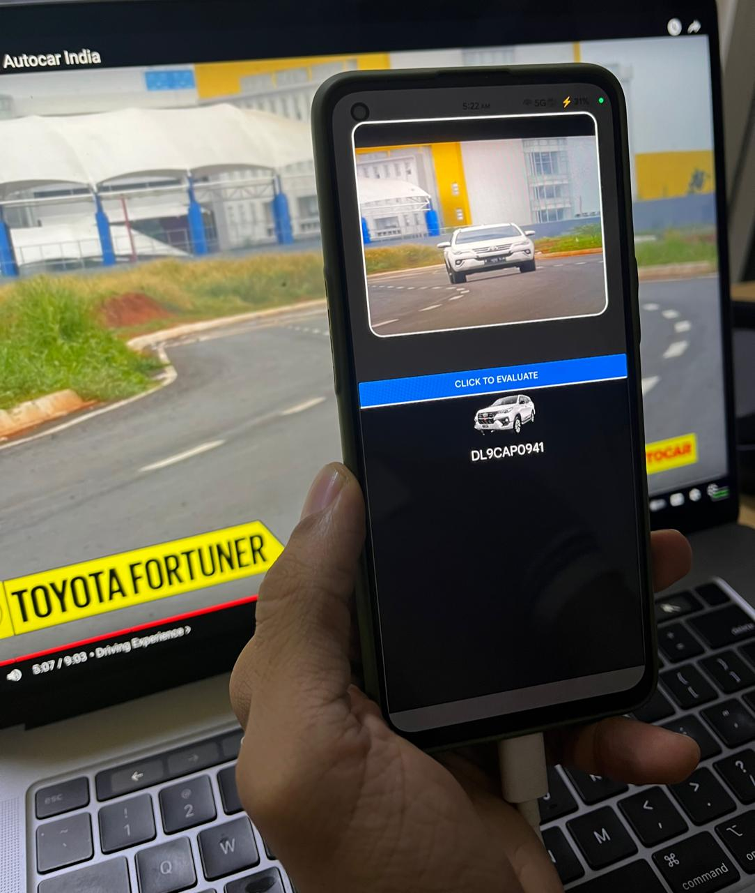

<h1 align='center'> Zesta - Your Car App </h1>

    

Swift license plate recognition deep learning model with a cross-platform front-end to obtain info. pertaining to the vehicle in real-time. This project is currently an MVP, with the vision to become a one-stop car app.

## About The Project

Zesta is a cross-platform mobile application that allows you to scan a vehicle's license plate and get information about it in real-time. The app uses your phone's camera to capture an image of the license plate, sends it to a server for processing, and displays the results.

The backend is powered by a Node.js server that communicates with a Python script. The Python script uses a deep learning model to recognize the license plate from the image.

## Features

*   **Cross-Platform:** Works on iOS, Android, and the web.
*   **Real-time Recognition:** Get instant information about a vehicle from its license plate.
*   **Camera Integration:** Use your phone's camera to capture license plates.
*   **WebSocket Communication:** Real-time, two-way communication between the client and server.

## Tech Stack

| Technology                    | Utility                     |
| ----------------------------- | --------------------------- |
| Expo (React-Native Framework) | iOS, Android, Web Frontends |
| NodeJS                        | Server Backend              |
| Python                        | ML Tasks                    |
| Ultralytics (YOLO)            | License Plate Detection     |
| EasyOCR                       | Optical Character Recognition |
| OpenCV                        | Image Processing            |
| WebSockets                    | Real-time Communication     |

## Usage

1.  Open the app on your device.
2.  Point your camera at a license plate and tap the "Click!!" button.
3.  Tap the "Send to server for evaluation!!" button.
4.  Henceforth, obtain license plate number and other relevant vehicle information.

## Under Development

This project is currently an MVP. The vision is to develop it into a multi-feature, one-stop car app. Future features could include:

*   **Integration with Indian RTO's Parivahan Database:** To fetch official vehicle and owner data.
*   **Challan/Fine Tracking:** Check for any outstanding traffic fines.
*   **Insurance and PUC Status:** Verify the validity of the vehicle's insurance and Pollution Under Control (PUC) certificate.
*   **Registered Owner Information:** Display details of the registered owner.
*   **Digital Garage:** A feature to manage your own vehicles, track repairs, and set reminders for insurance renewals, etc.
*   **All-in-One:** Access all these features simply by taking a picture of a license plate.